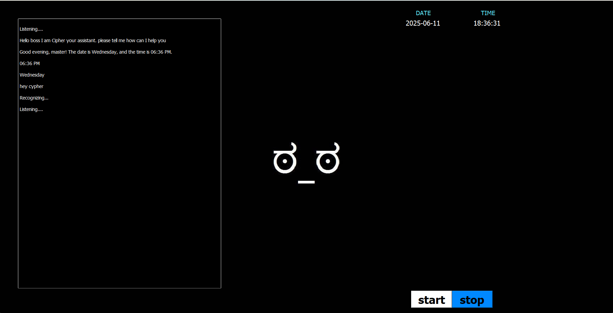
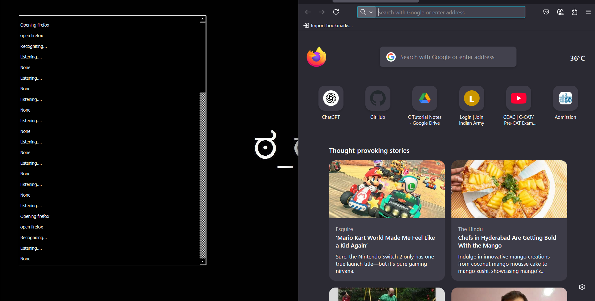
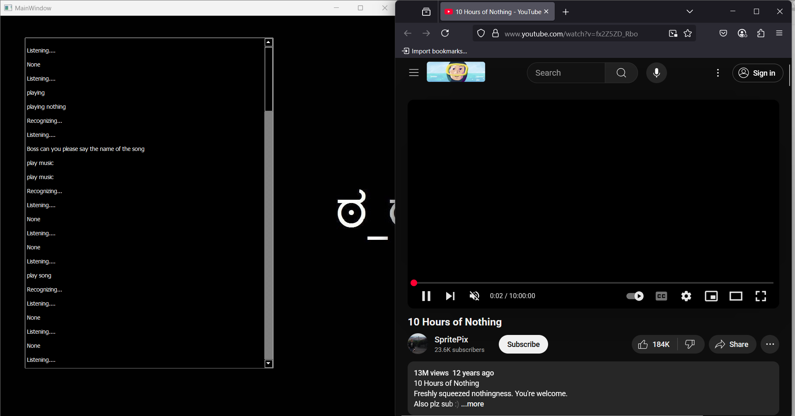
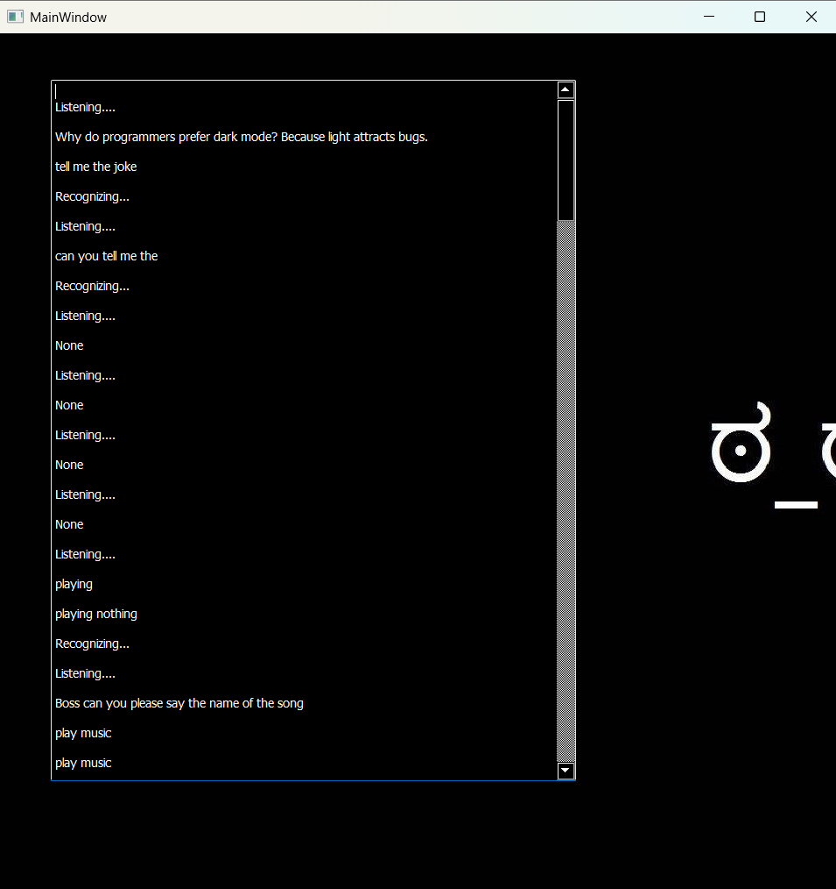
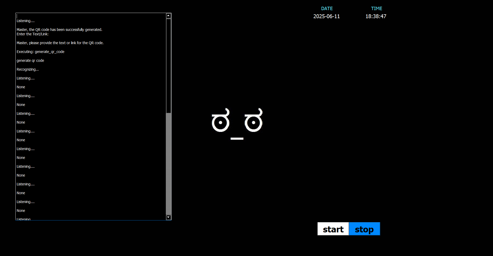
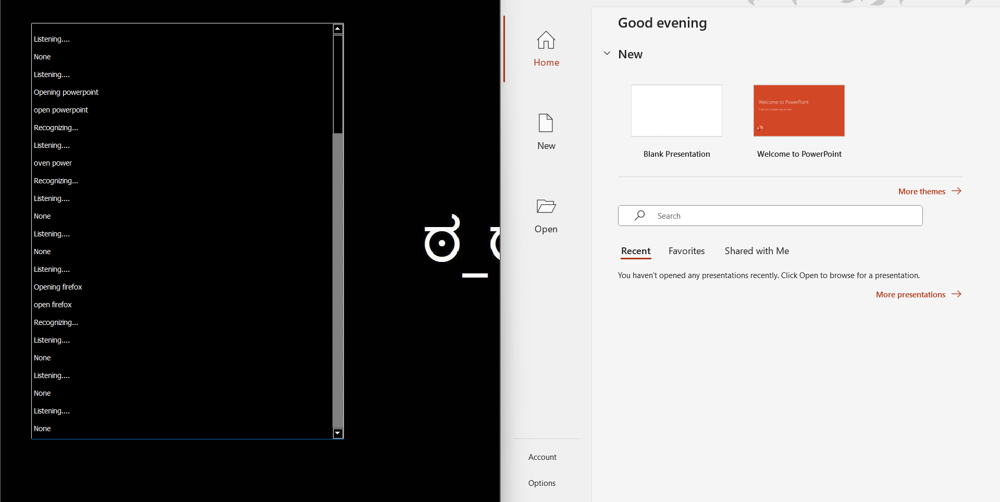

# 🤖 CIPHER – Voice-Controlled Personal Assistant in Python

CIPHER is a powerful python powered desktop voice assistant built with Python. It can listen to your commands, respond intelligently, and perform a wide range of tasks like managing files, sending WhatsApp messages, automating system operations, recording your screen, reading PDFs, tracking phone locations, and much more.

---

## 🎥 Demo Video

<video src="media/demo.mp4" controls autoplay loop muted style="width:100%; max-width:800px;"></video>

> ⚠️ Make sure to upload `demo.mp4` in the `media/` folder of this repository.

---

## 🔧 Features

<details>
<summary><strong>🎙️ Voice & Interaction</strong></summary>

- Hotword activation: “Hey Cipher” / “Wake up”
- Smart NLP + fuzzy matching for command execution
- Speaks responses using `pyttsx3`
- Personalized replies and casual conversations
</details>

<details>
<summary><strong>📞 Communication & Contacts</strong></summary>

- Send WhatsApp messages (contacts & groups)
- Search by contact name or number
- Show all saved contacts
- Add new contacts by voice
- Send email via voice
</details>

<details>
<summary><strong>🎥 Multimedia & Control</strong></summary>

- Play/Pause/Next/Previous media
- Volume up/down, mute/unmute
- Take screenshot
- Start/stop screen & audio recording
- Play music/videos from YouTube
- Download YouTube videos
</details>

<details>
<summary><strong>🛠️ System & App Control</strong></summary>

- Open or close any installed application
- Maximize, minimize windows
- Create or delete files/folders
- Shutdown, restart, or put system to sleep
- Enable silent mode (timed muting)
</details>

<details>
<summary><strong>🧠 Intelligence & Memory</strong></summary>

- Remembers tasks or notes
- Lists saved reminders
- Logs previous activities
- Intelligent fuzzy command matching
</details>

<details>
<summary><strong>🌐 Online & API Utilities</strong></summary>

- Check internet speed (upload/download)
- Get public IP address
- Fetch weather (via OpenWeatherMap)
- Get latest news
- Search Wikipedia or Google
</details>

<details>
<summary><strong>📚 Learning & Schedule</strong></summary>

- Read aloud from PDF files
- Voice-activated “how to” search using WikiHow
- Check time and current day
- Daily college timetable scheduler
- Tell jokes, fun replies, chatbot responses
</details>

<details>
<summary><strong>📍 Location & COVID</strong></summary>

- Track any phone number (location, operator, lat/lon)
- Check COVID-19 statistics per Indian state
- Open map with geolocation
</details>

<details>
<summary><strong>📷 QR & Instagram Tools</strong></summary>

- Generate custom QR codes
- View & download Instagram profile pictures
</details>

<details>
<summary><strong>📝 Editor & Desktop Automation</strong></summary>

- Type text by speaking
- Scroll up/down/left/right
- Select, copy, paste, cut
- Bold, italic, underline, font size control
- Add/delete slides/pages/lines
</details>

---

## 📷 Screenshots

| Welcome Screen | opens any app | plays music and songs on youtube |
|----------------|------------------|------------------|
|  |  |  |

| tells joke | QR Code Generator | power poni|type | bold | italic |
|----------------|-------------------|------------|
|  |  |  |

---

## 🛠️ Technologies Used

- Python 3.9+
- PyQt5
- pyttsx3
- speech_recognition
- pyautogui
- opencv-python
- instaloader
- pytube
- BeautifulSoup
- nltk
- fuzzywuzzy
- pywhatkit
- speedtest
- qrcode
- requests

---

## 📁 Project Structure

```bash
CIPHER/
├── CIPHER.py               # Main assistant logic
├── CipherUi.py             # GUI code
├── appstore.py             # App opener
├── memory_manager.py       # Logs & reminders
├── media/                  # demo.mp4 video
├── screenshots/            # PNG/GIF screenshots
├── Contacts.txt            # Contact database
├── LICENSE
├── README.md
└── ...
